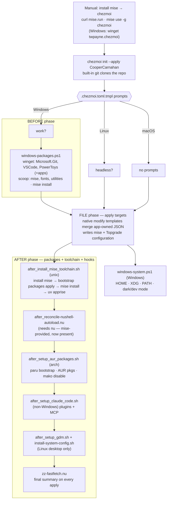

# dotfiles

Cross-platform [chezmoi](https://chezmoi.io) dotfiles for Windows, macOS, and Linux
(Arch/CachyOS + Debian/Ubuntu).

## Design

- **[mise](https://mise.jdx.dev) is the package authority on unix.** One manifest —
  `dot_config/mise/config.toml.tmpl` — declares both the dev CLI toolchain (`[tools]`: `nu`,
  ripgrep, node, uv, `claude`, and ~50 more) and the system packages
  (`[bootstrap.packages]`: pacman/apt/brew/brew-cask — OS/build packages and GUI apps).
- **Scripts cover only what mise can't:** AUR packages via paru
  (`run_onchange_after_setup_aur_packages`) and the whole Windows layer (winget + scoop —
  mise has no backends for those).
- **[Topgrade](https://github.com/topgrade-rs/topgrade) owns updates.** It runs chezmoi first,
  then upgrades the system package manager, mise tools, and the other managers it detects.
  Chezmoi only provisions declared state and never calls Topgrade, so the flow cannot recurse.

App-owned JSON configs (`~/.claude/settings.json`, Windows PowerToys/Terminal) use native
`chezmoi:modify-template` merges. They preserve unknown/runtime keys and emit the original
bytes when the managed values already match, so application key ordering creates neither
diff noise nor apply churn. No external interpreter is required during the file phase.

On unix the bootstrap runs almost entirely in the `after` phase
(`run_onchange_after_install_mise_toolchain`): `mise bootstrap packages apply` installs the
system packages, then `mise install` materializes the toolchain — neither can happen earlier,
because both read `~/.config/mise/config.toml`, which the file phase itself puts in place.
(Windows keeps its mise install in the `before` script, driven by scoop.)

## First run on a new machine

The only manual prerequisite is mise; chezmoi comes through it. Chezmoi clones this repo with
its **built-in git**, so a system `git` is *not* required for the initial clone — `mise
bootstrap packages apply` installs git (and everything else) during the first apply.

### macOS / Linux

```sh
curl https://mise.run | sh
export PATH="$HOME/.local/share/mise/shims:$HOME/.local/bin:$PATH"
mise use -g chezmoi
chezmoi init --apply CooperCarnahan
```

`mise use -g` installs chezmoi and writes a minimal `~/.config/mise/config.toml`; the file
phase replaces it with this repo's full manifest.

The `PATH` export makes the newly installed chezmoi shim visible immediately. A login shell
will not have that directory yet on a fresh box because it did not exist at login. This is the
same invocation the Podman full-tier test validates.

- **macOS:** no Homebrew install needed — mise's `brew`/`brew-cask` backends install formulas
  and casks directly (one sudo prompt to create `/opt/homebrew` on a brew-less mac). No
  chezmoi prompts. If you'll compile anything (cargo builds, etc.), run
  `xcode-select --install` first — nothing in the bootstrap pulls the CLT anymore.
- **Arch / CachyOS:** prompts **"Is this a headless machine?"** (defaults to `false` on
  Arch/CachyOS). The pacman set — plus, on non-headless boxes, the Wayland desktop stack +
  GDM — applies via `mise bootstrap packages` in the `after` phase; AUR packages follow via
  paru in `setup_aur_packages`.
- **Debian / Ubuntu:** treated as a headless server. The apt build toolchain applies via
  `mise bootstrap packages` in the `after` phase. (No desktop packages.)

### Windows

```powershell
winget install twpayne.chezmoi
chezmoi init --apply CooperCarnahan
```

- Prompts **"Is this a work machine?"** — `true` skips the personal apps (1Password, NordVPN,
  Claude, Zen).
- The before-script installs `Microsoft.Git` + apps via winget, then Scoop, then mise, then the
  toolchain.
- **If the apply stops with `mise not found on PATH`:** Scoop just added mise's shim but this
  shell hasn't picked it up. Open a new terminal and run `chezmoi apply` again.

## How the bootstrap runs

Every platform follows the same skeleton: the file phase uses dependency-free native
modifiers and writes the mise/Topgrade manifests, then the after phase provisions packages
and tools. Windows installs its application packages and mise in the before phase so those
applications exist before their configs are applied. Fastfetch is a plain, lexically last
after hook, so it is the actual completion summary.



## Testing

Podman-based bootstrap tests for Arch and Debian live in `tests/podman/`
(see [its README](tests/podman/README.md)):

```sh
tests/podman/run.sh                     # smoke tier: template render + apply asserts (~2 min)
tests/podman/run.sh --tier full debian  # full tier: the real fresh-system bootstrap
```

CI runs the smoke tier on every push/PR and the full tier weekly.

## Keeping a machine current

`chezmoi apply` only **provisions**: it ensures declared packages and tools are present and
applies configuration. It does not upgrade already-installed software. Editing
`[bootstrap.packages]` or `[tools]` changes the manifest hash and re-runs provisioning.

Run `mise run update` to update the machine; it asks for confirmation before starting the
potentially lengthy Topgrade pass. The managed Topgrade config runs chezmoi first, then the
detected system and language package managers. Because chezmoi never calls Topgrade, this
one-way flow cannot recurse. Calling `topgrade` directly skips the wrapper confirmation. For
unattended agents or scripts:

```sh
mise run update-unattended
```

This passes `--yes --no-ask-retry`. On Arch/CachyOS, Topgrade is configured to use `paru`, so
repository and AUR packages participate in one full transaction rather than a partial upgrade.
`mise bootstrap` remains a local converge command: packages, tools, then `chezmoi apply`
without fetching or upgrading anything.

## Layout

| Path | Purpose |
|---|---|
| `.chezmoi.toml.tmpl` | Prompts, data, interpreters, structural diff + JSON normalization |
| `.chezmoiscripts/` | Per-OS `run_onchange_*` bootstrap scripts (system packages + mise) |
| `.chezmoitemplates/` | Desired JSON plus the native semantic merge helper |
| `.chezmoiignore` | OS/role-gated ignore rules |
| `.chezmoiversion` | Minimum chezmoi version (uses `promptBoolOnce`, `includeTemplate`, `lookPath`) |
| `dot_config/mise/config.toml.tmpl` | The dev toolchain manifest |
| `dot_config/topgrade.toml.tmpl` | One-way update orchestration and per-OS manager policy |
