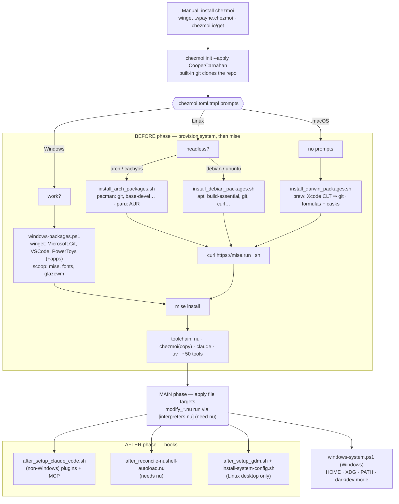

# dotfiles

Cross-platform [chezmoi](https://chezmoi.io) dotfiles for Windows, macOS, and Linux
(Arch/CachyOS + Debian/Ubuntu).

## Design

- **The system package manager installs only OS/build packages and GUI apps.**
  On Windows that's winget + scoop; macOS Homebrew; Arch pacman/paru; Debian apt.
- **[mise](https://mise.jdx.dev) installs the entire dev CLI toolchain** — `nu`, `jq`,
  ripgrep, node, uv, `claude`, and ~50 more, from `dot_config/mise/config.toml.tmpl`.

The bootstrap scripts under `.chezmoiscripts/` run in chezmoi's `before` phase: they install
the system packages, install mise, then run `mise install` — so the toolchain exists before
any file targets (some are `nu` scripts that need mise's `nu`) are applied.

> The `chezmoi = "latest"` entry in the mise config is a **managed convenience copy**, not the
> binary that bootstraps the machine. The initial chezmoi below is what does the first apply.

## First run on a new machine

The only manual prerequisite is chezmoi itself. chezmoi clones this repo with its **built-in
git**, so a system `git` is *not* required for the initial clone — the bootstrap scripts
install git (and everything else) during the first apply.

### macOS / Linux

```sh
sh -c "$(curl -fsSL https://chezmoi.io/get)" -- init --apply CooperCarnahan
```

Installs chezmoi to `~/.local/bin`, clones `github.com/CooperCarnahan/dotfiles`, and applies.

- **macOS:** the darwin script installs Homebrew (which pulls in the Xcode Command Line Tools,
  and thus `git`), brew formulas/casks, mise, then the toolchain. No prompts.
- **Arch / CachyOS:** prompts **"Is this a headless machine?"** (defaults to `false` on
  Arch/CachyOS). Installs pacman + AUR (via paru) packages, mise, toolchain, and — on non-headless
  boxes — the Wayland desktop stack + GDM.
- **Debian / Ubuntu:** treated as a headless server. Installs the apt build toolchain, mise,
  then the toolchain. (No desktop packages.)

### Windows

```powershell
winget install twpayne.chezmoi
chezmoi init --apply CooperCarnahan
```

- Prompts **"Is this a work machine?"** — `true` skips the personal apps (1Password, NordVPN,
  Claude, Zen).
- The before-script installs `Microsoft.Git` + apps via winget, then Scoop, then mise, then the
  toolchain.
- **If the apply stops with `mise not found on PATH`:** Scoop just added mise's shim but this
  shell hasn't picked it up. Open a new terminal and run `chezmoi apply` again.

## How the bootstrap runs

Every platform follows the same skeleton — only the package-install node swaps by OS, and all
branches reconverge at `mise install`. This diagram is the ground truth for script ordering
(the nodes are the actual script basenames in `.chezmoiscripts/`):



## Keeping a machine current

`chezmoi apply` **provisions** (ensures packages are present). The package scripts are
`run_onchange_`, so they only re-run when their contents change — e.g. a `chezmoi update`
that pulls changes to them.

- **Dev toolchain (all OS):** `mise upgrade`.
- **Windows:** whenever the bootstrap re-runs it also **upgrades** everything in a tail phase —
  `mise upgrade`, `winget upgrade --all`, `scoop update *` — and prints a `fastfetch` summary.
  `Microsoft.Git` upgrades in-flavor.
- **macOS:** `brew upgrade`. **Arch:** `paru -Syu` (the bootstrap also runs `mise upgrade`).
  **Debian:** `sudo apt-get upgrade`.

## Layout

| Path | Purpose |
|---|---|
| `.chezmoi.toml.tmpl` | Prompts (work/headless), `[data]`, `.ps1`/`.nu` interpreters, merge tool |
| `.chezmoiscripts/` | Per-OS `run_onchange_*` bootstrap scripts (system packages + mise) |
| `.chezmoiignore` | OS/role-gated ignore rules |
| `.chezmoiversion` | Minimum chezmoi version (uses `promptBoolOnce`, `includeTemplate`, `lookPath`) |
| `dot_config/mise/config.toml.tmpl` | The dev toolchain manifest |
